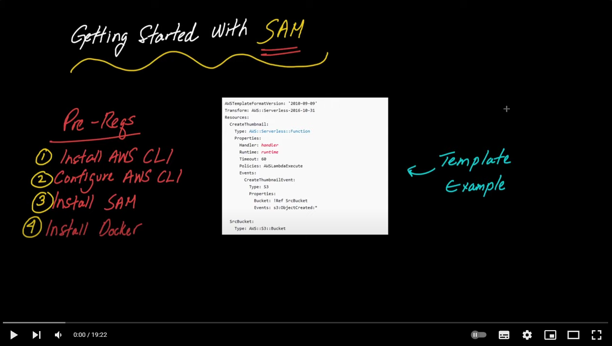

# SAM AWS Templates Repository

Bem-vindo ao repositório de templates prontos para o AWS Serverless Application Model (SAM). Este espaço foi criado para facilitar o desenvolvimento rápido e eficiente de aplicações serverless na AWS.

## Objetivo do Repositório

O objetivo principal deste repositório é fornecer templates SAM prontos para uso, abordando diferentes casos de uso comumente encontrados em projetos serverless.

## Pré-requisitos de Instalação

Antes de começar, certifique-se de ter o AWS CLI e o SAM CLI instalados. Caso contrário, siga as instruções de instalação disponíveis na [documentação oficial da AWS SAM CLI](https://docs.aws.amazon.com/serverless-application-model/latest/developerguide/serverless-sam-cli-install.html).

## Templates Disponíveis

| Nome do Template                                                                      | Disponível   | Descrição                                                                               | Arquitetura                                                           | Criado por                                    |
|---------------------------------------------------------------------------------------|--------------|-----------------------------------------------------------------------------------------|-----------------------------------------------------------------------|-----------------------------------------------|
| [LakeFormation Permission](templates/lakeformation-permission)                        | &check;      | Conceder permissões a bancos de dados e tabelas no Lakeformation a um usuário ou função | [Link para Arquitetura](/templates/lakeformation-permission/arq.png)  | [AriHenrique](https://github.com/AriHenrique) |
| [ETL Architecture for API Financial Modeling Prep](templates/financial-modeling-prep) | &check;      | Arquitetura ETL API Financial Modeling Prep utilizando DBT                              | [Link para Arquitetura](/templates/financial-modeling-prep/arq.svg)   | [AriHenrique](https://github.com/AriHenrique) |


## Como Usar

1. Clone o repositório localmente: `git clone https://github.com/AriHenrique/sam-templates-aws.git`
2. Navegue até o diretório do template desejado: `cd sam-templates/templates/nome-do-template`
3. Siga as instruções detalhadas no README específico do template.

## Utilizando o AWS SAM
[](https://www.youtube.com/watch?v=MipjLaTp5nA&t=1s&pp=ugMICgJwdBABGAHKBQtzYW0gaW5zdGFsbA%3D%3D)

Para implantar um template, utilize o comando `sam deploy`. Certifique-se de configurar suas credenciais AWS antes de prosseguir.

```bash
sam deploy --guided
```

## Agradecimentos

Agradecemos por escolher nosso repositório SAM! Caso tenha sugestões, encontrou problemas ou queira contribuir, sinta-se à vontade para abrir uma issue ou enviar um pull request.

Happy coding!