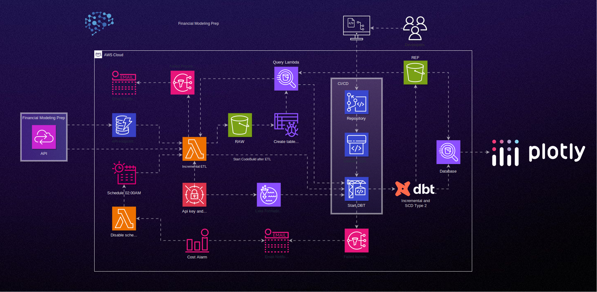

# ETL API Financial Modeling Prep utilizando DBT

## Descrição

Este é um template AWS CloudFormation que define uma arquitetura de ETL para modelagem financeira usando a API Financial Modeling Prep. O objetivo é extrair dados da API, transformá-los e carregá-los em um data lake, proporcionando flexibilidade na análise de dados.

## Parâmetros

- **TagProject**: Nome do projeto. Padrão: `project-name`.
- **TagEnv**: Ambiente do projeto. Padrão: `dev`.
- **TagRaw**: Tag para recursos raw. Padrão: `raw`.
- **TagRef**: Tag para recursos ref. Padrão: `ref`.
- **TagAthena**: Tag para recursos Athena. Padrão: `athena`.
- **NameS3Bucket**: Nome do bucket S3. Padrão: `default-name-bucket`.
- **NameLambdaFunction**: Nome da função Lambda. Padrão: `lambda-name`.
- **NameRoleLambda**: Nome da função IAM associada à Lambda. Padrão: `lambda-name-role`.
- **NameCrawlerRole**: Nome da função IAM associada ao Glue Crawler. Padrão: `crawler-name-role`.
- **NameScheduleV2**: Nome do agendamento da Lambda. Padrão: `schedule-name-v2`.
- **HourSchedule**: Hora do agendamento. Padrão: `2`.
- **MinuteSchedule**: Minuto do agendamento. Padrão: `0`.
- **EnableSchedule**: Habilitar agendamento. Padrão: `N` (Opções: `Y` ou `N`).
- **EmailSNS**: Endereço de e-mail para notificações. Padrão: `<email>`.
- **GroupName**: Nome do grupo IAM. Padrão: `athena_query_name`.
- **UserName**: Nome do usuário IAM. Padrão: `user-dbt-query`.
- **ApiKey**: Chave de API para Financial Modeling Prep. Padrão: `<api-key>`.
- **NameCodeCommitRepo**: Nome do repositório CodeCommit. Padrão: `dbt-repo`.
- **NameCodeBuild**: Nome do projeto CodeBuild. Padrão: `dbt-build`.

## Recursos

O template cria diversos recursos, incluindo buckets S3, funções Lambda, roles IAM, tabelas Glue, e configurações do AWS Lake Formation. Esses recursos trabalham juntos para construir a arquitetura ETL.

## Como Usar

1. Substitua os valores padrão ou ajuste os parâmetros conforme necessário.
2. Implante o modelo usando a AWS CloudFormation.
3. Após a implantação, os dados da API Financial Modeling Prep serão processados e disponibilizados para análise no Athena.