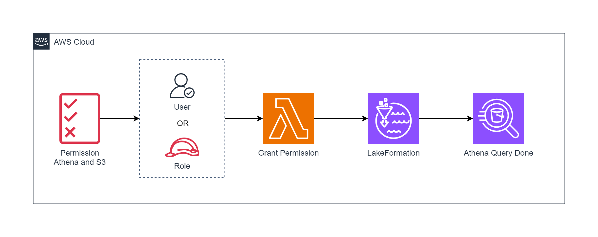

# AWS CloudFormation Template for Lake Formation Permission



## Description

Este é um modelo de exemplo do AWS CloudFormation para conceder permissões "all" em todos os bancos de dados e tabelas do AWS Lake Formation. O objetivo é criar recursos necessários para gerenciar permissões em um ambiente de Lake Formation.

Este template configura permissões abrangentes para todos os bancos de dados e tabelas no Lake Formation.

## Parâmetros

- **UserName**: Nome do usuário IAM a ser criado. Padrão: `user_lakeformation`

## Recursos

### 1. UserIAM

- **Tipo**: `AWS::IAM::User`
- **Descrição**: Cria um usuário IAM com políticas gerenciadas para Amazon Athena e Amazon S3.

### 2. LambdaFunction

- **Tipo**: `AWS::Serverless::Function`
- **Descrição**: Cria uma função Lambda chamada "lake-formation-permission" com permissões específicas para s3, Athena, Glue, Lake Formation e concedendo permissões "all" em todos os bancos de dados e tabelas. A função utiliza o ARN do usuário IAM criado, se não fornecido como parâmetro, a variável de ambiente `arn_permission` será utilizada..
- **Entrada de Evento**: A função Lambda aceita um JSON de entrada com a chave 'arn' para especificar o ARN da entidade IAM. Exemplo:
      ```json
      {
        "arn": "arn:aws:iam::123456789012:<you-arn-user-or-role>"
      }
      ```

### 3. DataLakeSettings

- **Tipo**: `AWS::LakeFormation::DataLakeSettings`
- **Descrição**: Configura as configurações do AWS Lake Formation, especificamente adicionando o Lambda como administrador.

### 4. RoleLambda

- **Tipo**: `AWS::IAM::Role`
- **Descrição**: Cria uma função IAM para a função Lambda com permissões completas no Lake Formation, Athena, Glue e S3, concedendo permissões "all" em todos os bancos de dados e tabelas.

## Configurações Globais

- **Timeout**: 120 segundos
- **MemorySize**: 128 MB

## Como Usar

1. Substitua os valores padrão ou ajuste os parâmetros conforme necessário.
2. Implante o modelo usando a AWS CloudFormation.
3. Após a implantação, a função Lambda "lake-formation-permission" terá permissões "all" para todos os bancos de dados e tabelas do Lake Formation.
